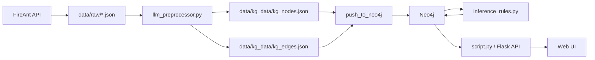
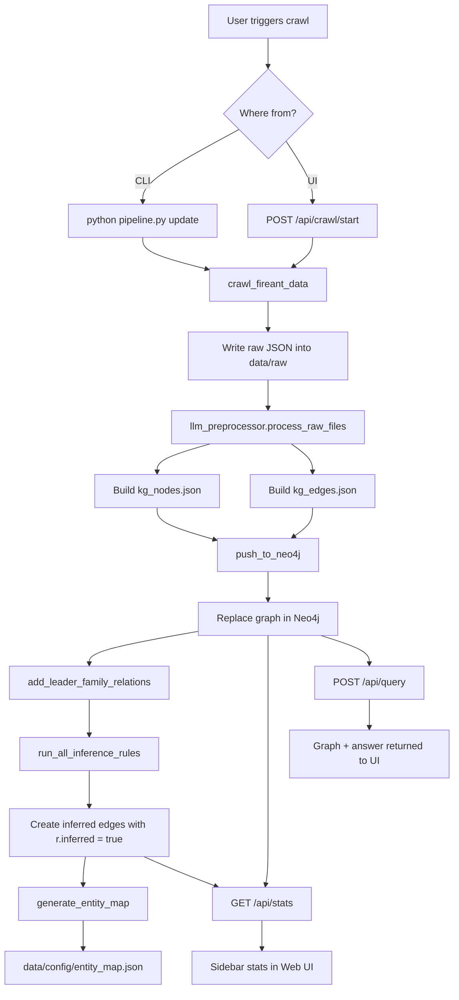

# Vietnam Listed Companies KG

Knowledge Graph cho doanh nghiệp niêm yết Việt Nam, xây từ dữ liệu FireAnt và phục vụ cả hai nhu cầu:

- khám phá quan hệ doanh nghiệp bằng graph
- hỏi đáp qua Web UI + API

Trọng tâm hiện tại của repo là pipeline chuẩn hóa dữ liệu từ FireAnt thành graph trong Neo4j, sau đó suy diễn thêm các quan hệ ẩn dựa trên rule.

## Highlights

- Crawl dữ liệu `officers`, `holders`, `subsidiaries`, `individuals` từ FireAnt
- Chuẩn hóa trực tiếp JSON thành `nodes` và `edges`
- Push toàn bộ graph vào Neo4j
- Suy diễn quan hệ ẩn bằng Cypher rule engine
- Cung cấp Flask Web UI + REST API
- Hỗ trợ backend LLM qua `ollama` hoặc OpenAI-compatible / vLLM

## Giải thích các hàm

### `kg_from_scratch/pipeline.py`

Entry point đúng cho dữ liệu FireAnt.

Nó thực hiện:

1. crawl từ FireAnt
2. preprocess dữ liệu
3. sinh `kg_nodes.json` và `kg_edges.json`
4. push graph lên Neo4j
5. làm giàu quan hệ gia đình lãnh đạo
6. chạy hidden relation inference
7. cập nhật `entity_map.json`

### `kg_from_scratch/script.py`

Đây là Flask app cho Web UI và API ở cổng `5001`.

Chức năng chính:

- graph dashboard
- search entity
- crawl API
- stats API
- inference API
- query/chat API
- node detail API

Với dữ liệu FireAnt, nên ưu tiên `pipeline.py update` để cập nhật KG. `script.py` là lớp phục vụ giao diện và endpoint.

## Kiến trúc project



## Workflow



## Quick Start

### Docker

```bash
docker compose up -d --build
```

Sau khi chạy:

- Web UI: `http://localhost:5001`
- Neo4j Browser: `http://localhost:7474`

`docker-compose.yml` hiện khởi động:

- `neo4j`
- `kg-app`

Mount quan trọng:

- `./kg_from_scratch/data:/app/kg_from_scratch/data`
- `./kg_from_scratch:/app/kg_from_scratch`

Điều này giúp dữ liệu và source code đồng bộ giữa host và container.

### Local Dev

Theo quy ước hiện tại của project, nên dùng conda env `kg`.

```bash
cd kg_from_scratch
conda create -n kg python=3.12 -y
conda activate kg
pip install -r requirements-docker.txt
```

Chạy Web UI:

```bash
cd kg_from_scratch
python script.py
```

Cập nhật dữ liệu FireAnt:

```bash
cd kg_from_scratch
python pipeline.py update
```

## Configuration

### Tracked config

- `kg_from_scratch/.env.docker`: cấu hình app an toàn để chạy Docker

### Local-only config

- `.env`: cấu hình local, đã được gitignore

Các biến FireAnt hiện được đọc từ `.env` local:

```env
FIREANT_BASE_URL=https://restv2.fireant.vn
FIREANT_TOKEN=REPLACE_WITH_YOUR_FIREANT_TOKEN
```

Các endpoint FireAnt repo đang dùng:

- `/symbols/{SYMBOL}/officers`
- `/symbols/{SYMBOL}/subsidiaries`
- `/symbols/{SYMBOL}/holders`
- `/individuals/{INDIVIDUAL_ID}/profile`
- `/individuals/{INDIVIDUAL_ID}/jobs`
- `/individuals/{INDIVIDUAL_ID}/assets`
- `/individuals/{INDIVIDUAL_ID}/relations`

LLM config phổ biến:

```env
LLM_BACKEND=openai
LLM_BASE_URL=http://host.docker.internal:9061
VLLM_BASE_URL=http://host.docker.internal:9061
MODEL_NAME=qwen3-14b
```

Hoặc với Ollama:

```env
LLM_BACKEND=ollama
LLM_BASE_URL=http://host.docker.internal:11434
MODEL_NAME=qwen3:8b
```

## CLI

```bash
cd kg_from_scratch

python pipeline.py crawl [--symbols ...] [--banks-only] [--skip-individuals] [--reset]
python pipeline.py resume
python pipeline.py update [--symbols ...] [--banks-only] [--skip-individuals] [--no-push] [--no-inference]
python pipeline.py preprocess
python pipeline.py push
python pipeline.py entity-map
```

Luồng khuyến nghị:

```bash
python pipeline.py update
```

Một số biến thể hữu ích:

```bash
python pipeline.py update --banks-only
python pipeline.py update --symbols VCB ACB FPT
python pipeline.py update --skip-individuals
python pipeline.py update --no-push
python pipeline.py update --no-inference
```

## Suy luận các quan hệ ẩn

Hidden relation hiện nằm ở `kg_from_scratch/inference_rules.py` và chạy hoàn toàn bằng rule/Cypher, không dùng LLM.

Các rule hiện có:

- gộp sở hữu vợ chồng -> `KIỂM_SOÁT_GIA_ĐÌNH`
- sở hữu gián tiếp -> `SỞ_HỮU_GIÁN_TIẾP`
- ảnh hưởng gián tiếp theo ngưỡng
  - `CÓ_LỢI_ÍCH_GIÁN_TIẾP`
  - `ẢNH_HƯỞNG_GIÁN_TIẾP_TỚI`
  - `KIỂM_SOÁT_GIÁN_TIẾP`
- liên kết qua cùng cổ đông lớn -> `CÙNG_CỔ_ĐÔNG_LỚN`

### Căn cứ pháp lý, giải thích và ví dụ

#### Gộp sở hữu vợ chồng

- Giải thích: khi hai vợ chồng cùng nắm cổ phần tại một doanh nghiệp, hệ thống cộng tỷ lệ sở hữu để phản ánh mức ảnh hưởng theo hộ gia đình thay vì chỉ nhìn từng cá nhân riêng lẻ.
- Ví dụ: ông A nắm `18%` và bà B nắm `12%` tại công ty C, hệ thống suy ra gia đình A-B có `30%` ảnh hưởng tại C.
- Căn cứ pháp lý chính thức:
  - [Thông tư 96/2020/TT-BTC](https://vanban.chinhphu.vn/default.aspx?docid=201902&pageid=27160)
  - [Nghị định 168/2025/NĐ-CP](https://vanban.chinhphu.vn/?docid=214334&pageid=27160)
  - [Luật số 76/2025/QH15 - Luật sửa đổi, bổ sung một số điều của Luật Doanh nghiệp](https://vanban.chinhphu.vn/?classid=1&docid=214562&pageid=27160&typegroupid=3)

#### Sở hữu gián tiếp qua công ty con

- Giải thích: nếu A sở hữu B và B sở hữu hoặc kiểm soát C, hệ thống nhân chuỗi tỷ lệ để tính phần sở hữu gián tiếp của A tại C.
- Ví dụ: A nắm `40%` ở B, B nắm `60%` ở C, hệ thống suy ra A sở hữu gián tiếp `24%` ở C.
- Căn cứ pháp lý chính thức:
  - [Luật số 54/2019/QH14 - Luật Chứng khoán](https://vanban.chinhphu.vn/default.aspx?docid=198541&pageid=27160)
  - [Thông tư 96/2020/TT-BTC](https://vanban.chinhphu.vn/default.aspx?docid=201902&pageid=27160)

#### Ảnh hưởng gián tiếp theo ngưỡng 5/25/50

- Giải thích: sau khi tính được tỷ lệ gián tiếp, hệ thống gán nhãn theo ngưỡng pháp lý. Từ `5%` là lợi ích gián tiếp, từ `25%` là ảnh hưởng đáng kể, từ `50%` là kiểm soát.
- Ví dụ: A nắm `30%` ở B, B nắm `51%` ở C. Tỷ lệ gián tiếp của A tại C là `15.3%`, nên hệ thống gán `CÓ_LỢI_ÍCH_GIÁN_TIẾP`.
- Căn cứ pháp lý chính thức:
  - [Thông tư 96/2020/TT-BTC](https://vanban.chinhphu.vn/default.aspx?docid=201902&pageid=27160)
  - [Nghị định 168/2025/NĐ-CP](https://vanban.chinhphu.vn/?docid=214334&pageid=27160)
  - [Luật số 54/2019/QH14 - Luật Chứng khoán](https://vanban.chinhphu.vn/default.aspx?docid=198541&pageid=27160)

#### Liên kết qua cùng cổ đông lớn

- Giải thích: nếu cùng một cá nhân là cổ đông lớn tại hai doanh nghiệp niêm yết, hệ thống tạo liên kết để giúp phát hiện mạng lưới ảnh hưởng chéo.
- Ví dụ: ông A nắm `8%` ở công ty X và `6%` ở công ty Y, hệ thống suy ra X và Y có liên hệ qua cùng cổ đông lớn là ông A.
- Căn cứ pháp lý chính thức:
  - [Thông tư 96/2020/TT-BTC](https://vanban.chinhphu.vn/default.aspx?docid=201902&pageid=27160)
  - [Luật số 54/2019/QH14 - Luật Chứng khoán](https://vanban.chinhphu.vn/default.aspx?docid=198541&pageid=27160)

Lưu ý quan trọng:

- dữ liệu công ty con hiện giữ cả 2 chiều:
  - `CÓ_CÔNG_TY_CON`
  - `LÀ_CÔNG_TY_CON_CỦA`
- inference đã hỗ trợ cả dữ liệu mới và dữ liệu cũ tương thích ngược
- UI đếm `Quan hệ ẩn` bằng số cạnh có `r.inferred = true`

Chạy inference thủ công:

```bash
curl -X POST http://localhost:5001/api/inference/run
```

## Data Layout

### Raw

- `data/raw/banks.json`
- `data/raw/officers.json`
- `data/raw/holders.json`
- `data/raw/subsidiaries.json`
- `data/raw/individuals.json`
- `data/raw/crawler_state.json`

### Processed Graph

- `data/kg_data/kg_nodes.json`
- `data/kg_data/kg_edges.json`

### Metadata

- `data/config/entity_map.json`
- `data/last_crawl_success.json`

## Graph Model

### Nodes

- `Person`: id dạng `P_...`
- `Company`: id dạng `C_...`, `C_INST_...`, `C_UNL_...`

### Direct Relationships

- `LÀ_CỔ_ĐÔNG_CỦA`
- `CÓ_CÔNG_TY_CON`
- `LÀ_CÔNG_TY_CON_CỦA`
- `CHỦ_TỊCH_HĐQT`
- `TỔNG_GIÁM_ĐỐC`
- `LÃNH_ĐẠO_CAO_NHẤT`
- `CHA_MẸ`
- `VỢ_CHỒNG`
- `ANH_CHỊ`
- `LÀ_NGƯỜI_THÂN_CỦA_LÃNH_ĐẠO`

### Inferred Relationships

- `SỞ_HỮU_GIÁN_TIẾP`
- `CÓ_LỢI_ÍCH_GIÁN_TIẾP`
- `ẢNH_HƯỞNG_GIÁN_TIẾP_TỚI`
- `KIỂM_SOÁT_GIÁN_TIẾP`
- `KIỂM_SOÁT_GIA_ĐÌNH`
- `CÙNG_CỔ_ĐÔNG_LỚN`

## API

### Web

- `GET /`

### Graph and Stats

- `GET /api/graph`
- `GET /api/stats`
- `GET /api/stats/exchange`
- `GET /api/stats/top`
- `GET /api/search?q=...`
- `GET /api/node/<node_id>`
- `GET /api/node/<node_id>/neighbors`

### Crawl and Inference

- `POST /api/crawl/start`
- `GET /api/crawl/progress`
- `POST /api/inference`
- `POST /api/inference/run`
- `GET /api/inferred-relations`
- `GET /api/rules`

### LLM and Query

- `POST /api/query`
- `GET /api/vllm/models`
- `GET /api/ollama/models`

## Useful Checks

Kiểm tra stats:

```bash
curl http://localhost:5001/api/stats
```

Kiểm tra inferred relations:

```bash
curl http://localhost:5001/api/inferred-relations
curl http://localhost:5001/api/inferred-relations?level=HIGH
```

Kiểm tra quan hệ trong Neo4j:

```bash
docker compose exec neo4j cypher-shell -u neo4j -p password123 \
  "MATCH ()-[r]->() RETURN type(r) AS type, count(*) AS count ORDER BY count DESC LIMIT 20"
```

## Repository Structure

```text
kg_from_scratch_docker/
├── docker-compose.yml
├── .gitignore
├── .env                  # local only, gitignored
└── kg_from_scratch/
    ├── script.py
    ├── pipeline.py
    ├── llm_preprocessor.py
    ├── inference_rules.py
    ├── reset_db.py
    ├── crawl_continue.py
    ├── verify_resume.py
    ├── requirements-docker.txt
    ├── templates/
    ├── scripts/
    └── data/
```

## Troubleshooting

### `Quan hệ ẩn = 0`

Kiểm tra theo thứ tự:

1. đã chạy `python pipeline.py update` hoặc `POST /api/inference/run` chưa
2. `GET /api/stats` có `inferred_relationships = 0` thật hay chỉ UI chưa refresh
3. trong Neo4j có dữ liệu `holders` và `subsidiaries` chưa
4. `data/last_crawl_success.json` có `neo4j_pushed = true` không

### `update` không sinh dữ liệu mới

Nếu FireAnt đã crawl hết và không có raw file mới cần preprocess, `crawl_and_update()` sẽ trả về:

- `nodes_count = 0`
- `edges_count = 0`
- `neo4j_pushed = false`

### FireAnt token thiếu hoặc hết hạn

Repo hiện không còn fallback token hardcode trong source.

Hãy cấu hình lại `.env` local:

```bash
FIREANT_TOKEN=your_new_token
```

## Notes

- README này được viết lại theo logic code hiện tại của repo
- các số liệu snapshot dễ stale đã được loại bỏ
- `.env`, `.agents`, `.cursor` và ghi chú FireAnt riêng đã được tách khỏi repo tracking để tránh lộ cấu hình local
