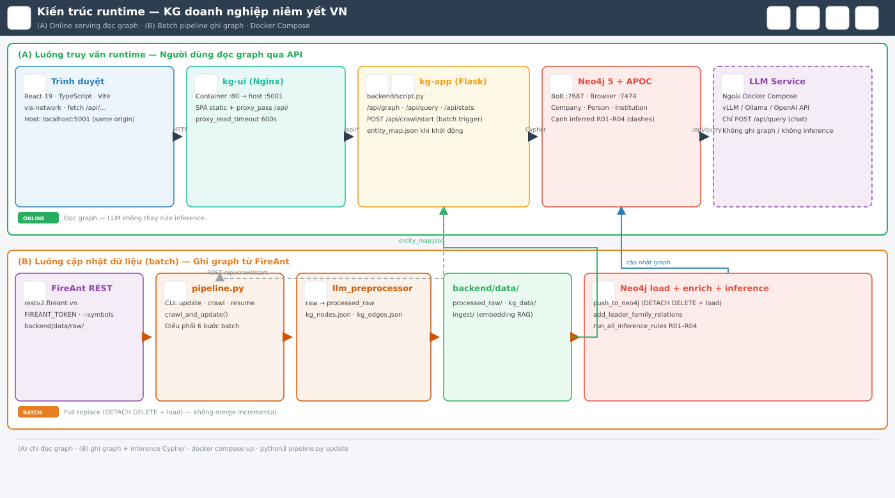

# Vietnam Listed Companies Knowledge Graph

Knowledge Graph cho doanh nghiệp niêm yết Việt Nam:

1. Khám phá đồ thị: sở hữu, lãnh đạo, công ty con, liên kết liên quan.
2. Truy vấn qua web: graph explorer, tìm kiếm, thống kê, quan hệ suy diễn, panel trợ lý (query + cấu hình LLM).

Các khối code chính:

| Vai trò | File / thư mục |
|--------|------------------|
| Pipeline crawl → preprocess → Neo4j | `backend/pipeline.py` |
| Chuẩn hóa raw, ingest, file graph JSON | `backend/llm_preprocessor.py` |
| Luật suy diễn cạnh ẩn | `backend/inference_rules.py` |
| API Flask + khởi động RAG/ingest tùy dữ liệu | `backend/script.py` |
| Neo4j + LLM runtime | `backend/app/runtime.py` |
| UI | `frontend/` (React, Vite, vis-network) |
| Docker | `docker-compose.yml`, `docker/nginx.conf` |

**Tài liệu trình bày (Markdown + ảnh):** [`docs/PRESENTATION_DECK_CONTENT.md`](docs/PRESENTATION_DECK_CONTENT.md) và [`docs/ppt_assets/`](docs/ppt_assets/) — copy vào slide hoặc PDF thủ công; không còn script build `.pptx` trong repo.

## Mục lục

- [1. Tổng quan](#1-tổng-quan)
- [2. Chạy nhanh](#2-chạy-nhanh)
  - [2.1 Yêu cầu](#21-yêu-cầu)
  - [2.2 Docker (full stack)](#22-docker-full-stack)
  - [2.3 Chạy local backend và frontend](#23-chạy-local-backend-và-frontend)
  - [2.4 Cập nhật dữ liệu (CLI)](#24-cập-nhật-dữ-liệu-cli)
- [3. Kiến trúc và luồng dữ liệu](#3-kiến-trúc-và-luồng-dữ-liệu)
  - [3.1 Thành phần](#31-thành-phần)
  - [3.2 Runtime Docker: ai nhận request, cổng nào](#32-runtime-docker-ai-nhận-request-cổng-nào)
  - [3.3 Sơ đồ SVG kiến trúc runtime](#33-sơ-đồ-svg-kiến-trúc-runtime)
  - [3.4 Pipeline dữ liệu: từng bước trong code](#34-pipeline-dữ-liệu-từng-bước-trong-code)
- [4. API và tính năng UI](#4-api-và-tính-năng-ui)
  - [4.1 Frontend](#41-frontend)
  - [4.2 Endpoint API](#42-endpoint-api)
  - [4.3 Tech stack](#43-tech-stack)
- [5. Cấu trúc repo](#5-cấu-trúc-repo)
  - [5.1 Cây thư mục rút gọn](#51-cây-thư-mục-rút-gọn)
  - [5.2 File và thư mục đáng đọc](#52-file-và-thư-mục-đáng-đọc)
- [6. Cấu hình và rủi ro vận hành](#6-cấu-hình-và-rủi-ro-vận-hành)
  - [6.1 Biến môi trường](#61-biến-môi-trường)
  - [6.2 Lưu ý quan trọng](#62-lưu-ý-quan-trọng)

## 1. Tổng quan

Dữ liệu niêm yết được kéo về qua **API FireAnt** (REST theo `FIREANT_BASE_URL`): cổ đông, lãnh đạo, công ty con, người thân trong mạng sở hữu, ảnh hưởng gián tiếp qua tầng trung gian — thông tin nằm trong nhiều **payload/bảng** của cùng nguồn, khó phân tích dạng mạng nếu chỉ xem từng màn hình riêng lẻ.

Repo gom về **một graph Neo4j**, thêm **cạnh suy diễn theo luật**, rồi phục vụ **REST `/api/*`** và **SPA** gọi cùng origin qua Nginx.

Hai entrypoint tách bạch:

- **`pipeline.py`**: cập nhật dữ liệu (CLI hoặc được gọi từ luồng crawl trong `script.py`).
- **`script.py`**: web server Flask; không phải “chỉ đọc graph” — khi start có thể chạy bước ingest/RAG tùy file trong `ingest/` (xem mục 3.4).

## 2. Chạy nhanh

### 2.1 Yêu cầu

| Mục | Ghi chú |
|-----|---------|
| Docker + Compose | Chạy `neo4j`, `kg-app`, `kg-ui` |
| Python 3 + venv | Chạy backend ngoài container |
| Node + npm | `npm run dev` cho frontend dev |
| `FIREANT_TOKEN` | Bắt buộc khi crawl FireAnt thật |
| LLM đang lên | Cần cho `/api/query` và panel model (theo `LLM_BASE_URL` trong `.env.docker`) |

### 2.2 Docker (full stack)

```bash
export FIREANT_TOKEN=YOUR_FIREANT_TOKEN   # tuỳ chọn: chỉ xem UI với data sẵn có thì không cần
docker compose up -d --build
```

Hoặc: `chmod +x ./manage.sh && ./manage.sh`

| URL / cổng | Nội dung |
|------------|----------|
| `http://localhost:5001` | UI (Nginx + SPA), API qua `/api/*` |
| `http://localhost:5002` | Flask trực tiếp trên host (map container `:5001`) |
| `http://localhost:7474` | Neo4j Browser |
| `localhost:7687` | Bolt |

Compose: `kg-ui` map `5001:80`, proxy `/api/` → `kg-app:5001`; `kg-app` map host `5002:5001`; Neo4j `7474`/`7687`.

### 2.3 Chạy local backend và frontend

Backend (thư mục `backend/`):

```bash
python3 -m venv .venv && source .venv/bin/activate
pip install -r requirements-docker.txt
python3 script.py
```

Flask bind `0.0.0.0:5001`.

Frontend:

```bash
cd frontend && npm install && npm run dev
```

`vite.config.ts` proxy `/api` → `http://127.0.0.1:5001` → khớp backend local trên cổng 5001.

Chỉ chạy Docker `kg-app` (API host `5002`) mà vẫn dùng Vite mặc định: cần đổi `target` proxy sang `5002` hoặc chỉ dùng UI tại `http://localhost:5001` (qua Nginx, không cần Vite).

### 2.4 Cập nhật dữ liệu (CLI)

```bash
cd backend
python3 pipeline.py update
python3 pipeline.py resume
python3 pipeline.py preprocess
python3 pipeline.py push
python3 pipeline.py entity-map
```

Tham số hữu ích: `--symbols VCB FPT`, `--skip-individuals`, `--no-push`, `--no-inference`.

## 3. Kiến trúc và luồng dữ liệu

### 3.1 Thành phần

- **`pipeline.py`**: crawl FireAnt → preprocess → (tuỳ chọn) `push_to_neo4j` → enrich quan hệ gia đình → `run_all_inference_rules` → cập nhật entity map.
- **`llm_preprocessor.py`**: đọc `data/raw/`, ghi `processed_raw/`, `ingest/`, `processed/`, `kg_data/kg_nodes.json` + `kg_edges.json`.
- **`inference_rules.py`**: tạo cạnh `inferred` trong Neo4j.
- **`script.py`**: định nghĩa route `/api/*`, crawl background thread gọi `crawl_and_update` từ `pipeline`.
- **`app/runtime.py`**: driver Neo4j, cấu hình llmware/Chroma, gọi LLM, ghi `.env.docker` khi đổi model qua API.
- **`docker/nginx.conf`**: static SPA + `proxy_pass` `/api/` tới `kg-app`.

### 3.2 Runtime Docker: ai nhận request, cổng nào

**Luồng người dùng (đọc graph / gọi API qua trình duyệt):**

| Bước | Ai xử lý | Chi tiết |
|------|----------|------------|
| 1 | Trình duyệt | GET `http://localhost:5001/` |
| 2 | Container `kg-ui` (Nginx) | Trả file tĩnh từ build Vite; mọi `GET/POST .../api/...` không đọc từ đĩa |
| 3 | Nginx `location /api/` | `proxy_pass http://kg-app:5001` (cùng path `/api/...`) |
| 4 | Container `kg-app` (`script.py`) | Flask xử lý; đọc/ghi Neo4j qua driver trong `runtime.py` |
| 5 | Neo4j container | Bolt nội bộ `bolt://neo4j:7687` (theo `.env.docker`) |
| 6 | LLM (ngoài compose) | Chỉ khi route cần: ví dụ `POST /api/query`, fetch model — HTTP tới `LLM_BASE_URL` |

**Luồng crawl từ UI:** `POST /api/crawl/start` → thread trong `kg-app` → `pipeline.crawl_and_update` (cùng codebase với CLI).

**Luồng crawl từ CLI:** `python3 pipeline.py update` trên máy host hoặc trong container — không qua Nginx.

### 3.3 Sơ đồ SVG kiến trúc runtime



### 3.4 Pipeline dữ liệu: từng bước trong code

**A. Pipeline đầy đủ (`pipeline.py`, lệnh `update` hoặc crawl từ API):**

1. Crawl FireAnt → ghi `backend/data/raw/`.
2. `llm_preprocessor.process_raw_files()` → `processed_raw/`, file vào `ingest/`, build `kg_data/kg_nodes.json` + `kg_edges.json`.
3. `push_to_neo4j()`: chạy `MATCH (n) DETACH DELETE n` rồi nạp lại toàn bộ node/edge từ hai file JSON (full replace, không merge incremental).
4. `add_leader_family_relations` (trong pipeline) → bổ sung cạnh người thân lãnh đạo.
5. `run_all_inference_rules` → cạnh suy diễn, `r.inferred = true` tùy luật.
6. Sinh lại `backend/data/config/entity_map.json`.

**B. Khởi động `script.py` (API server):**

Trước `app.run()`, code có thể:

- Gọi `generate_entity_map.py` khi đã có `data/kg_data/kg_nodes.json`.
- `rebuild_rag_corpus_from_processed_raw()` khi corpus trống.
- `process_new_files()`: khi còn file trong `data/ingest/` → ingest llmware + embedding → có thể `run_ner_and_relation_extraction` và vòng inference ẩn.

→ Đây là **đường ingest song song** với pipeline FireAnt; không thay thế bước `push_to_neo4j` từ JSON snapshot.

**C. Chat / query:**

- Rule inference **không** dùng LLM để “bịa” cạnh mới trong DB.
- `POST /api/query` dùng graph hiện có + RAG + tài liệu `backend/docs/` + LLM để sinh Cypher/trả lời.

## 4. API và tính năng UI

### 4.1 Frontend

Graph công ty/người, lazy neighbors, stats, search, chi tiết node, bảng quan hệ suy diễn + context, panel trợ lý (query + LLM settings), nút crawl + tiến trình.

### 4.2 Endpoint API

Graph / node / search / stats: `GET /api/graph`, `/api/node/<id>`, `/api/node/<id>/neighbors`, `/api/search`, `/api/stats`, `/api/stats/exchange`, `/api/stats/top`.

Crawl / inference: `POST /api/crawl/start`, `GET /api/crawl/progress`, `POST /api/inference/run`, `POST /api/inference`, `GET /api/inferred-relations`, `GET /api/inferred-relations/context`, `GET /api/rules`.

LLM / query: `GET /api/vllm/models`, `GET /api/ollama/models`, `GET|POST /api/llm/settings`, `POST /api/llm/fetch-models`, `POST /api/query`.

`GET /` trên Flask: health/info JSON, không phải HTML app.

### 4.3 Tech stack

Backend / data:


Python, Flask, Neo4j driver, `requests`, `python-dotenv`, **llmware**, **ChromaDB**, **sentence-transformers** (embedding PhoBERT trong code ingest).

Frontend:


React 19, TypeScript, Vite, vis-network, marked, DOMPurify.

Infra:


Docker Compose, Nginx, tùy chọn Cloudflare Quick Tunnel (`manage.sh`).

*(Badge shield: ảnh PNG/SVG từ shields.io — hiển thị tốt trên GitHub và nhiều viewer Markdown.)*

## 5. Cấu trúc repo

### 5.1 Cây thư mục rút gọn

```text
.
├── backend/
│   ├── app/
│   ├── data/
│   ├── docs/
│   ├── scripts/
│   ├── inference_rules.py
│   ├── llm_preprocessor.py
│   ├── pipeline.py
│   ├── requirements-docker.txt
│   └── script.py
├── docker/
├── frontend/
│   ├── public/
│   └── src/
├── docker-compose.yml
├── Dockerfile
├── Dockerfile.frontend
├── manage.sh
└── README.md
```

### 5.2 File và thư mục đáng đọc

| Path | Việc làm |
|------|----------|
| `backend/app/runtime.py` | Neo4j URI, LLM backend, model list, ghi `.env.docker` |
| `backend/app/web.py` | Đối tượng Flask `app` |
| `backend/docs/` | Grounding Cypher / schema / luật inference |
| `backend/scripts/generate_entity_map.py` | `entity_map.json` |
| `frontend/src/components/AssistantPanel.tsx` | Query + cấu hình LLM |
| `frontend/src/graph/useKgGraph.ts` | Tải graph, neighbors |

## 6. Cấu hình và rủi ro vận hành

### 6.1 Biến môi trường

```env
FIREANT_BASE_URL=https://restv2.fireant.vn
FIREANT_TOKEN=YOUR_FIREANT_TOKEN
NEO4J_URI=neo4j://localhost:7687
NEO4J_USERNAME=neo4j
NEO4J_PASSWORD=password123
LLM_BACKEND=openai
LLM_BASE_URL=http://localhost:9061
VLLM_BASE_URL=http://localhost:9061
MODEL_NAME=qwen3-14b
OPENAI_API_KEY=
```

Docker: `backend/.env.docker` là `env_file` của `kg-app` và được COPY thành `.env` trong image backend.

### 6.2 Lưu ý quan trọng

- Crawl thật: cần `FIREANT_TOKEN`; Compose mặc định chuỗi rỗng.
- Assistant: LLM phải reach được từ container (địa chỉ trong `.env.docker` — thường phải là IP máy host hoặc `host.docker.internal`, không hardcode LAN của máy khác).
- `POST /api/llm/settings` ghi file `.env.docker`, **không có auth** — chỉ dùng trong mạng tin cậy.
- `push_to_neo4j()` **xóa toàn bộ graph** trước khi load lại từ JSON — không phải upsert incremental.
- Image backend: base **PyTorch CUDA** — dung lượng lớn so với Flask thuần.
- Hai chế độ dev: Vite→5001 (backend local) vs Docker API host 5002 — proxy phải khớp cổng đích.
