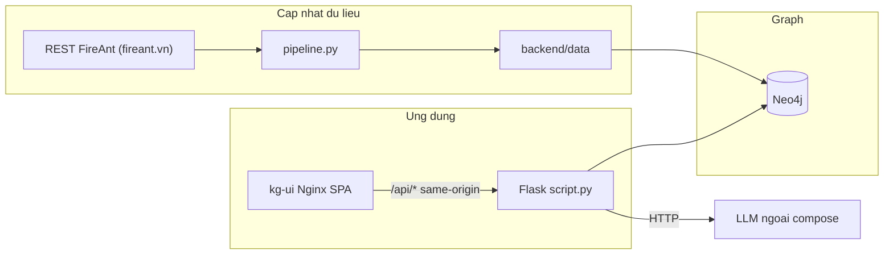
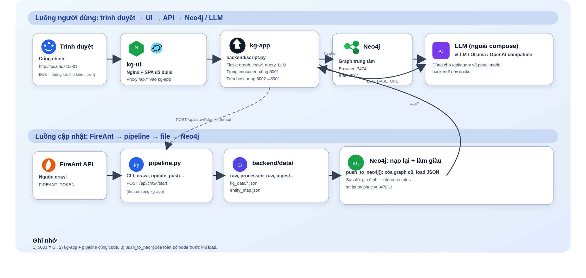
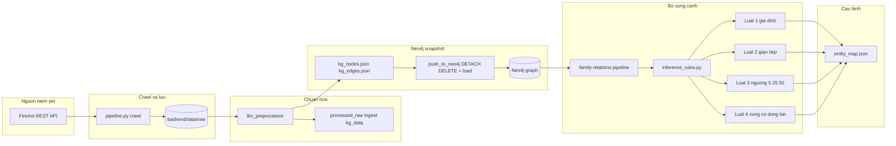
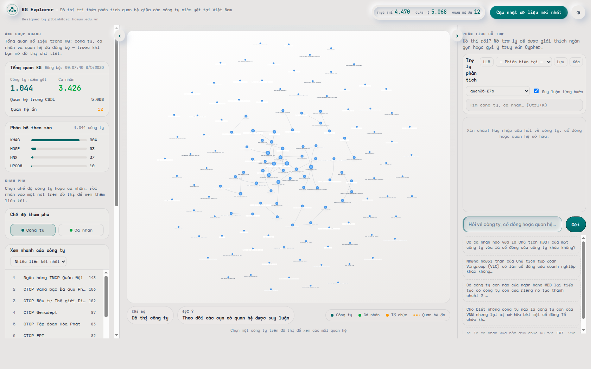
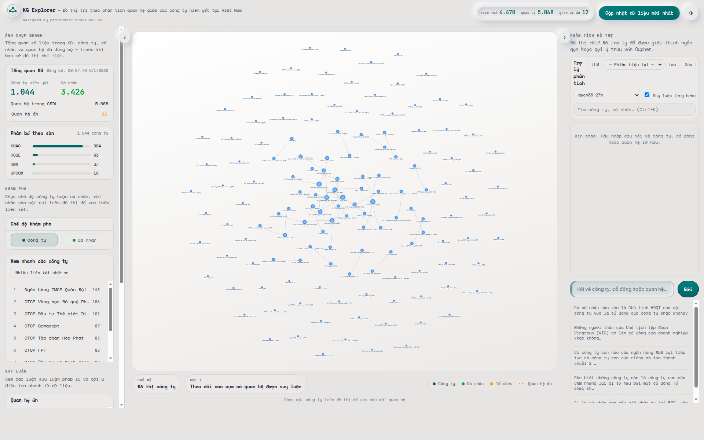

# Nội dung trình bày (Markdown + ảnh kèm)

Tài liệu này bám **đúng codebase** repo `kg_from_scratch_docker`: dùng làm script speaker, copy-paste vào slide (PowerPoint/Google Slides) hoặc xuất PDF/Markdown viewer. Đường dẫn ảnh tính từ thư mục **`docs/`** (cùng cấp file này). **Nguồn dữ liệu niêm yết trong pipeline chính:** REST [FireAnt](https://fireant.vn/) (`FIREANT_BASE_URL` trong cấu hình), không tích hợp thêm các API niêm yết khác trong luồng crawl chuẩn.

**Ảnh screenshot web** (URL chụp: `http://127.0.0.1:5001/` hoặc `http://localhost:5001/` khi stack Docker chạy; nội dung pixel phụ thuộc dữ liệu Neo4j và trạng thái UI tại thời điểm chụp — ghi lại ngày trong bảng khi làm mới):

| File | Mô tả ngắn | Ghi chú nguồn (cập nhật khi đổi ảnh) |
|------|------------|--------------------------------------|
| [ppt_assets/ui-dashboard.png](ppt_assets/ui-dashboard.png) | Toàn màn hình app (1680×1050) | **2026-05-11** — Chromium headless, `--virtual-time-budget=40000` (chờ SPA), `--no-sandbox`, `http://127.0.0.1:5001/` |
| [ppt_assets/ui-wide.png](ppt_assets/ui-wide.png) | Toàn màn hình khung rộng hơn (1920×1200), URL khác | **2026-05-11** — `--virtual-time-budget=45000`, `?layout=wide&ts=3` |
| [ppt_assets/ui-graph-focus.png](ppt_assets/ui-graph-focus.png) | Crop vùng graph | **2026-05-11** — `ffmpeg -vf crop=...` từ `ui-dashboard.png` |
| [ppt_assets/ui-assistant-panel.png](ppt_assets/ui-assistant-panel.png) | Crop cột phải / panel | **2026-05-11** — `ffmpeg` từ `ui-dashboard.png` |
| [ppt_assets/architecture-runtime.png](ppt_assets/architecture-runtime.png) | Raster từ SVG kiến trúc | Export từ [runtime-architecture.svg](../frontend/public/runtime-architecture.svg) |

**Logo dự án (vector, repo):** [../frontend/public/logo-kg.svg](../frontend/public/logo-kg.svg)

**Sơ đồ SVG gốc (repo):** [../frontend/public/runtime-architecture.svg](../frontend/public/runtime-architecture.svg)

**Tham khảo cách trình bày (doanh nghiệp, khán giả hỗn hợp):** một slide một ý; tiêu đề nêu kết luận ngắn thay vì chỉ ghi nhãn mục; tối đa 3–4 bullet; để khoảng trống và một hình minh họa rõ khi có thể (ví dụ hướng dẫn kiểu MIT Sloan “slides for superiors”, nguyên tắc “one slide one idea” trong tài liệu thiết kế slide chuyên nghiệp).

---

## Gợi ý layout chung cho toàn bộ deck

| Thành phần | Gợi ý |
|------------|--------|
| Tỷ lệ | 16:9 (chuẩn PowerPoint) |
| Tiêu đề slide | Trái, font đậm, 1 dòng; phụ đề 1 dòng nhỏ hơn |
| Nội dung | Bullet ngắn; bảng cho so sánh; **1 hình lớn / slide** cho phần Demo |
| Chân trang | Tên repo + ngày (tuỳ bạn) |

**Slide mở đầu (tuỳ chọn, trước mục 1):** Title — “Knowledge Graph — Doanh nghiệp niêm yết Việt Nam”; logo góc trái; dòng phụ: FireAnt · Neo4j · Flask · React.

---

## 1. Bối cảnh & bài toán

### 1.1 Mục đích slide

Trình bày **vì sao cần graph**, không đi vào kỹ thuật repo.

### 1.2 Layout gợi ý

- **Slide 1 — Tiêu đề mục:** nền tối hoặc accent; chữ lớn: “1. Bối cảnh & bài toán”.
- **Slide 2 — Vấn đề dữ liệu:** hai cột hoặc 4 ô bullet.

### 1.3 Nội dung (copy vào PPT)

**Dữ liệu niêm yết — một nguồn API (FireAnt):**

- Cổ đông, lãnh đạo, công ty con, cá nhân liên quan… được **lấy về qua REST FireAnt** (`https://fireant.vn/` / `FIREANT_BASE_URL`), lưu raw rồi chuẩn hóa trong repo — **không** mô tả dự án là “gom nhiều nguồn/API niêm yết khác nhau” ngoài FireAnt trong pipeline crawl chính.
- Vẫn khó trả lời câu hỏi dạng **mạng lưới** nếu chỉ xem từng bảng riêng lẻ: sở hữu **gián tiếp** qua chuỗi công ty, **cộng góp** cổ phần giữa người có quan hệ gia đình, ngưỡng **ảnh hưởng / liên kết** theo quy định pháp lý — các quan hệ đó cần **đồ thị + luật suy diễn** (xem mục 1.5).

**Kỳ vọng sản phẩm (đúng với repo này):**

- Một **graph thống nhất** (Neo4j) để truy vấn và hiển thị.
- **Luật suy diễn** bổ sung cạnh có nhãn/metadata (không nhờ LLM tự “bịa” cạnh trong DB).
- **Web UI** khám phá + **API** + **trợ lý** hỏi đáp (LLM bên ngoài cho sinh Cypher/trả lời).

**Không cam kết trong repo:** điều khoản dịch vụ FireAnt, SLA dữ liệu, quyền phân phối dữ liệu — chỉ mô tả kỹ thuật tích hợp.

### 1.4 Bảng tóm tắt “bài toán → câu trả lời của hệ thống”

| Câu hỏi kinh doanh (ví dụ) | Hệ thống trả lời bằng |
|----------------------------|------------------------|
| Ai sở hữu / lãnh đạo / liên kết công ty X? | Node + cạnh trong Neo4j; UI graph + `/api/node`, `/api/graph` |
| Có quan hệ suy diễn (gộp vợ chồng, gián tiếp, …)? | `inference_rules.py` + cạnh `inferred`; UI inferred panel |
| Hỏi tự nhiên trên dữ liệu đã có? | `POST /api/query` + LLM + RAG/docs (không thay thế rule inference) |

### 1.5 Bốn luật quan hệ ẩn (theo UI) — điều khoản & link

**Xác minh theo dữ liệu (không thay cho logic code):** gọi `GET /api/inferred-relations` trên môi trường đang chạy và gom theo trường `rule`. Trên snapshot thử **2026-05-11** (local, `127.0.0.1:5001`) có **12** cạnh `R03` và **0** bản ghi `R01` / `R02` / `R04` — tức trong KG đó **chưa có** cạnh suy diễn của Luật 1–2–4, không có nghĩa là các luật đó “tạo thêm loại quan hệ ẩn khác”: trong `inference_rules.py` mỗi luật chỉ gắn **một** nhãn cạnh Neo4j tương ứng (`KIỂM_SOÁT_GIA_ĐÌNH`, `SỞ_HỮU_GIÁN_TIẾP`, `CÙNG_CỔ_ĐÔNG_LỚN`).

**Luật 3 — ba `type()` trên Neo4j:** `CÓ_LỢI_ÍCH_GIÁN_TIẾP`, `ẢNH_HƯỞNG_GIÁN_TIẾP_TỚI`, `KIỂM_SOÁT_GIÁN_TIẾP` là **ba dải phần trăm gián tiếp** gắn với ngưỡng 5% / 25% / 50% (bỏ qua nếu &lt; 5%; đồng bộ `influence_level` = LOW / MEDIUM / HIGH trong DB). Đây **không phải** ba luật riêng. Trên **giao diện web và tài liệu trình bày** dùng **một** tên quan hệ: *Ảnh hưởng gián tiếp*, kèm mức **Thấp / Trung bình / Cao**; giá trị tiếng Anh LOW/MEDIUM/HIGH chỉ dùng trong code và Neo4j như hiện tại.

Tên **Luật 1 … Luật 4** và văn bản kèm theo lấy khớp [`RULES_API_PAYLOAD` trong `backend/app/rule_catalog.py`](../backend/app/rule_catalog.py) (API `/api/rules` và popup quan hệ ẩn trên UI). Cột **Ví dụ** dùng dữ liệu `GET /api/inferred-relations` trên môi trường dev khi có; nếu snapshot hiện không có cạnh suy diễn của luật đó thì dùng ví dụ minh họa bám logic trong catalog.

| Luật (UI) | Cạnh suy diễn (Neo4j) | Điều khoản tham chiếu + link bản điện tử | Ví dụ (DB KG / minh họa thực tế) |
|------------|-------------------------|------------------------------------------|-----------------------------------|
| **Luật 1** — Gộp sở hữu vợ chồng | `KIỂM_SOÁT_GIA_ĐÌNH` — cộng tỷ lệ cổ phần hai vợ chồng tại cùng một DN | [Thông tư 96/2020/TT-BTC](https://vanban.chinhphu.vn/default.aspx?docid=201902&pageid=27160) — **Điều 31** (công bố khi sở hữu từ 5% cổ phần có quyền biểu quyết; cổ đông lớn và nhóm liên quan). [Nghị định 168/2025/NĐ-CP](https://vanban.chinhphu.vn/?docid=214334&pageid=27160) — **Điều 17**, **Điều 18** (CSHH; kê khai/thông báo). [Luật 76/2025/QH15](https://vanban.chinhphu.vn/?classid=1&docid=214562&pageid=27160&typegroupid=3) — sửa đổi, bổ sung Luật Doanh nghiệp (khai báo người có liên quan của cổ đông). Tra số hiệu trên [vbpl.vn](https://vbpl.vn). | **DB mẫu (2026-05-11):** không có bản ghi `inferred_from` Luật 1 trong kết quả `inferred-relations` đang truy vấn. **Minh họa thực tế:** hai vợ chồng cùng nắm 18% và 12% một mã niêm yết → hệ thống gộp thành một cạnh `KIỂM_SOÁT_GIA_ĐÌNH` ~30% (đúng logic mô tả trong catalog). |
| **Luật 2** — Sở hữu gián tiếp qua công ty con | `SỞ_HỮU_GIÁN_TIẾP` — nhân chuỗi tỷ lệ cổ đông → công ty con → công ty cháu | [Luật Chứng khoán 54/2019/QH14](https://vanban.chinhphu.vn/default.aspx?docid=198541&pageid=27160) — công bố thông tin, cổ đông lớn, người có liên quan (tham chiếu chương công bố thông tin, ví dụ khu vực **Điều 33** trong bản chính thứ). [Thông tư 96/2020/TT-BTC](https://vanban.chinhphu.vn/default.aspx?docid=201902&pageid=27160) — **Điều 31**; Phụ lục VII. [vbpl.vn](https://vbpl.vn). | **DB mẫu (2026-05-11):** không có cạnh Luật 2 trong cùng snapshot. **Minh họa thực tế:** A nắm 40% B, B nắm 60% C → cạnh `SỞ_HỮU_GIÁN_TIẾP` A→C ~24% (nhân chuỗi như trong catalog). |
| **Luật 3** — Ảnh hưởng gián tiếp theo ngưỡng 5 / 25 / 50 | Trong Neo4j: `CÓ_LỢI_ÍCH_GIÁN_TIẾP`, `ẢNH_HƯỞNG_GIÁN_TIẾP_TỚI`, `KIỂM_SOÁT_GIÁN_TIẾP` — mỗi tên = một dải % gián tiếp (gắn LOW/MEDIUM/HIGH). Trên UI/docs: một tên *Ảnh hưởng gián tiếp* + mức Thấp / Trung bình / Cao. | [Thông tư 96/2020/TT-BTC](https://vanban.chinhphu.vn/default.aspx?docid=201902&pageid=27160) — **Điều 31**. [Nghị định 168/2025/NĐ-CP](https://vanban.chinhphu.vn/?docid=214334&pageid=27160) — **Điều 17**, **Điều 18**. [Luật Chứng khoán 54/2019/QH14](https://vanban.chinhphu.vn/default.aspx?docid=198541&pageid=27160) — công bố thông tin. [vbpl.vn](https://vbpl.vn). | **Từ DB (cùng snapshot):** `KIỂM_SOÁT_GIÁN_TIẾP` — *Ngân hàng Nhà nước Việt Nam* → *Công ty TNHH Chứng khoán Ngân hàng TMCP Ngoại Thương Việt Nam*, ~74,8% gián tiếp, mức **Cao**. `ẢNH_HƯỞNG_GIÁN_TIẾP_TỚI` — *NHNN* → *CTCP Chứng khoán Vietinbank*, ~48,8%, **Trung bình**. `CÓ_LỢI_ÍCH_GIÁN_TIẾP` — *Mizuho Bank, Ltd* → *CTCK NH TMCP Ngoại Thương*, ~15%, **Thấp**. |
| **Luật 4** — Liên kết qua cùng cổ đông lớn | `CÙNG_CỔ_ĐÔNG_LỚN` — cùng cá nhân là cổ đông lớn (≥ 5%) tại hai DN niêm yết | [Thông tư 96/2020/TT-BTC](https://vanban.chinhphu.vn/default.aspx?docid=201902&pageid=27160) — **Điều 31** khoản 1 (ngưỡng 5%). [Luật Chứng khoán 54/2019/QH14](https://vanban.chinhphu.vn/default.aspx?docid=198541&pageid=27160) — cổ đông lớn, người có liên quan (**Điều 33** và các điều cùng chương trong bản chính thứ). [vbpl.vn](https://vbpl.vn). | **DB mẫu (2026-05-11):** không có cạnh Luật 4 trong kết quả truy vấn. **Minh họa thực tế:** một cá nhân đồng thời là cổ đông lớn (ví dụ 8% tại mã X và 6% tại mã Y) → cạnh `CÙNG_CỔ_ĐÔNG_LỚN` giữa X và Y (đúng logic catalog). |

Logic Cypher / batch suy diễn chi tiết nằm trong [`backend/inference_rules.py`](../backend/inference_rules.py).

---

## 2. Giải pháp tổng thể

### 2.1 Mục đích slide

**Kiến trúc tổng quan:** 3 lớp — dữ liệu + graph + giao diện/API.

### 2.2 Layout gợi ý

- **Slide 1:** Một sơ đồ khối đơn giản (hoặc chèn ảnh PNG kiến trúc).
- **Slide 2:** Bảng “thành phần — vai trò — file”.

### 2.3 Sơ đồ tổng thể (Mermaid — có thể export ảnh cho PPT)

**Lưu ý chính xác:** `kg-ui` chỉ proxy `/api/` tới `kg-app`; static UI không gọi Flask trực tiếp từ trình duyệt qua cổng khác khi dùng Docker đúng compose hiện tại.

### 2.4 Ảnh kiến trúc (cho slide)

### 2.5 Bảng thành phần (đúng file trong repo)

| Thành phần | Vai trò | Vị trí code / cấu hình |
|-------------|---------|-------------------------|
| Pipeline | Crawl → preprocess → (tuỳ chọn) push Neo4j → enrich → inference → entity map | `backend/pipeline.py` |
| Preprocessor | Raw → `processed_raw/`, `ingest/`, `kg_data/*.json` | `backend/llm_preprocessor.py` |
| Inference | Cạnh suy diễn trong Neo4j | `backend/inference_rules.py` |
| API + tác vụ khởi động | REST; thread crawl; query; LLM settings | `backend/script.py` |
| Runtime | Neo4j driver, llmware/Chroma, gọi LLM | `backend/app/runtime.py` |
| UI | React + vis-network | `frontend/src/` |
| Reverse proxy | SPA + `/api/` → `kg-app:5001` | `docker/nginx.conf`, service `kg-ui` |

---

## 3. Workflow chi tiết

### 3.1 Mục đích slide

Tách **hai luồng** không trộn: (A) người dùng qua web; (B) cập nhật dữ liệu / pipeline.

### 3.2 Layout gợi ý

- **Slide 1:** Bảng “Request path Docker” (đã có trong README).
- **Slide 2:** Chuỗi bước pipeline (bullet hoặc flowchart).
- **Slide 3 (tuỳ chọn):** Khởi động `script.py` vs pipeline CLI — dễ nhầm, nên tách slide.

### 3.3 Luồng request (Docker) — bảng cho PPT

| Bước | Hành động | Chi tiết kỹ thuật |
|------|-----------|-------------------|
| 1 | Mở UI | `http://localhost:5001` → container `kg-ui` (Nginx port 80, map host `5001`) |
| 2 | Tải SPA | File tĩnh từ build Vite trong image `kg-ui` |
| 3 | Gọi API | `fetch('/api/...')` same-origin → Nginx `location /api/` |
| 4 | Proxy | `proxy_pass http://kg-app:5001` (giữ path `/api/...`) theo `docker/nginx.conf` |
| 5 | Xử lý | `kg-app` chạy `python script.py`, Flask lắng nghe **5001 trong container** |
| 6 | Host truy cập API trực tiếp | Map **`5002:5001`** trên host → `http://localhost:5002` |

### 3.4 Luồng cập nhật dữ liệu (pipeline) — chuỗi bước chính xác

1. **Crawl FireAnt** → ghi dưới `backend/data/raw/` (cần `FIREANT_TOKEN` khi crawl thật; compose có thể để rỗng).
2. **`llm_preprocessor.process_raw_files()`** → `processed_raw/`, file normalized vào `ingest/`, đồng thời build **`kg_data/kg_nodes.json`** và **`kg_edges.json`**.
3. **`push_to_neo4j()`** (trong `pipeline.py`): đọc hai file JSON → chạy **`MATCH (n) DETACH DELETE n`** → nạp lại toàn bộ graph (**full replace**, không merge incremental).
4. **Enrich quan hệ gia đình** (logic trong pipeline, gọi sau push).
5. **`run_all_inference_rules`** trên Neo4j driver.
6. **Cập nhật `backend/data/config/entity_map.json`** (cuối pipeline).

**Kích hoạt pipeline:**

| Cách | Code thực thi |
|------|----------------|
| CLI | `python3 pipeline.py update` (và các subcommand `resume`, `preprocess`, `push`, `entity-map`) |
| Từ UI | `POST /api/crawl/start` → `threading.Thread` trong `script.py` gọi `crawl_and_update` từ `pipeline` |

### 3.5 Luồng khởi động `script.py` (song song với pipeline JSON — dễ nhầm)

Khi chạy `python script.py`, **trước** `app.run()` code có thể:

- Chạy `generate_entity_map.py` **khi đã có** `data/kg_data/kg_nodes.json`.
- `rebuild_rag_corpus_from_processed_raw()` **khi** corpus cần phục hồi.
- `process_new_files()`: **khi** còn file trong `data/ingest/` → llmware ingest + embedding → có thể NER/relation + vòng inference ẩn.

Đây là **đường ingest/RAG** trên file trong `ingest/`, không thay thế semantics của `push_to_neo4j()` từ snapshot JSON.

### 3.6 Sơ đồ Mermaid — pipeline CLI/API (chi tiết, chiều ngang)

Luồng **một chiều trái → phải**: từ API FireAnt tới snapshot JSON, nạp Neo4j, enrich, suy diễn **Luật 1–4** (theo UI / `inference_rules.py`), rồi `entity_map.json`. (Đường **ingest/RAG** khi khởi động `script.py` vẫn song song theo mục 3.5 — không vẽ đầy đủ ở đây để tránh chồng lên snapshot pipeline.)

**Đọc nhanh:** `REST` là nguồn dữ liệu niêm yết **duy nhất** trong luồng crawl chuẩn; `INF` tạo cạnh suy diễn theo **bốn luật** đặt tên như trên UI — chi tiết văn bản pháp luật xem mục 1.5.

---

## 4. Tech stack & vận hành

### 4.1 Mục đích slide

Một slide **stack**, một slide **env + rủi ro + cổng**.

### 4.2 Bảng tech stack (theo `requirements-docker.txt` + `package.json`)

| Lớp | Công nghệ | Ghi chú |
|-----|-----------|---------|
| Backend | Python 3, Flask | Entry API: `script.py` |
| Graph DB | Neo4j 5 Community (+ APOC trong compose) | Bolt; URI trong Docker thường `bolt://neo4j:7687` trong `.env.docker` |
| Data / RAG lib | llmware, ChromaDB, sentence-transformers | Embedding PhoBERT trong luồng ingest (code `script.py` / preprocessor) |
| HTTP | requests | Crawl / gọi LLM |
| Config | python-dotenv | `.env` / `.env.docker` |
| Frontend | React 19, TypeScript, Vite | `npm run dev` cổng mặc định Vite |
| Graph UI | vis-network, vis-data | `frontend/src/graph/` |
| Markdown an toàn | marked, DOMPurify | Assistant / render |
| Container | Docker Compose | Services: `neo4j`, `kg-app`, `kg-ui` |
| Web server UI | Nginx (Alpine) trong image frontend | `Dockerfile.frontend` + `docker/nginx.conf` |

**Logo / badge (tuỳ chọn trên slide):** dùng badge shields như README hoặc logo SVG ở trên.

### 4.3 Biến môi trường (slide “cấu hình”)

| Biến | Ý nghĩa |
|------|---------|
| `FIREANT_BASE_URL` | Mặc định REST FireAnt (compose có override) |
| `FIREANT_TOKEN` | Bắt buộc cho crawl thật |
| `NEO4J_URI`, `NEO4J_USERNAME`, `NEO4J_PASSWORD` | Kết nối Bolt/Neo4j |
| `LLM_BACKEND`, `LLM_BASE_URL`, `MODEL_NAME`, `OPENAI_API_KEY` | LLM cho `/api/query` và panel cấu hình; `POST /api/llm/settings` có thể **ghi** `backend/.env.docker` (không auth) |

### 4.4 Rủi ro vận hành (bullet cho slide — factual)

- **`push_to_neo4j` xóa toàn bộ graph** trước khi load lại từ JSON — downtime logic đồ thị; cần backup / quy trình nếu production.
- **LLM** phải **truy cập được từ container** (`host.docker.internal` hoặc IP máy host đúng mạng).
- **`POST /api/llm/settings` không có authentication** — chỉ dùng trong mạng tin cậy.
- **Image backend** base PyTorch CUDA — dung lượng lớn, thời gian build lâu.
- **Hai mode dev:** Vite proxy → `127.0.0.1:5001` (backend local) vs Docker API host **5002** — cấu hình proxy phải khớp.

---

## 5. Demo giao diện

### 5.1 Mục đích slide

Liên kết **ảnh chụp thật** với **cấu trúc UI trong code** (`App.tsx`).

### 5.2 Bố cục trang (đúng component)

| Vùng màn hình | Component | API / hành vi chính (tham chiếu) |
|---------------|-----------|-----------------------------------|
| Thanh trên | `TopBar` | Theme, search, crawl, stats chips (dữ liệu từ `/api/stats`, …) |
| Cột trái | `LeftRail` | Rules, inferred list, điều khiển graph mode (`useKgGraph`) |
| Canvas giữa | Graph vis-network qua `useKgGraph` | `/api/graph`, lazy `/api/node/.../neighbors` |
| Panel phải (tuỳ trạng thái) | `NodeDetailPanel` | `/api/node/<id>` |
| Panel phải | `AssistantPanel` | `/api/query`, `/api/llm/settings`, `/api/vllm/models` hoặc Ollama |

Copy UI: `frontend/src/content/copy/vi.ts`.

### 5.3 Ảnh screenshot (chèn vào slide Demo)

**Toàn cảnh 1 — dashboard / graph area**

**Toàn cảnh 2 — cùng URL, khung thời gian render khác**

**Ghi chú nguồn ảnh:** Chụp từ UI đang chạy (`http://127.0.0.1:5001/`, Docker `kg-ui` hoặc tương đương). Dùng Chromium headless với **`--virtual-time-budget`** đủ lớn (ví dụ 40000 ms) để SPA không kẹt màn “loading”. Khi thay ảnh, cập nhật cột “Ghi chú nguồn” ở bảng đầu tài liệu.

### 5.4 Gợi ý chia nhỏ slide Demo (3–4 slide)

| Slide | Tiêu đề | Nội dung + hình |
|-------|---------|-----------------|
| D1 | “Tổng quan UI” | Một trong hai PNG full-width; bullet: cổng 5001, same-origin API |
| D2 | “Graph explorer” | Crop vùng canvas (tuỳ bạn từ PNG) + gọi API `/api/graph` |
| D3 | “Thống kê & crawl” | Crop `TopBar` / chip stats + `POST /api/crawl/start`, `GET /api/crawl/progress` |
| D4 | “Trợ lý & LLM” | Crop `AssistantPanel` + nhắc `/api/query`, rủi ro không auth trên `/api/llm/settings` |

---

## Phụ lục — Mapping nhanh “mục lục PPT → file repo”

| Mục PPT | File đọc thêm |
|---------|----------------|
| 1. Bối cảnh | (nghiệp vụ); README mục 1 |
| 2. Giải pháp | `docker-compose.yml`, `docker/nginx.conf`, `frontend/public/runtime-architecture.svg` |
| 3. Workflow | `backend/pipeline.py`, `backend/script.py` (đoạn `if __name__` + route crawl), `backend/llm_preprocessor.py` |
| 4. Tech & vận hành | `backend/requirements-docker.txt`, `frontend/package.json`, `backend/.env.docker` |
| 5. Demo | `frontend/src/App.tsx`, `frontend/src/components/*.tsx`, `frontend/src/graph/useKgGraph.ts` |

---

**Cách dùng file này**

- Dùng làm **gợi ý slide / speaker notes**; copy sang công cụ trình bày hoặc xuất PDF thủ công.
- Ảnh minh họa trong [`docs/ppt_assets/`](ppt_assets/) — cập nhật khi UI thay đổi.
- **Không** còn script tự động sinh `.pptx` trong repo; nếu cần deck PowerPoint, tạo file riêng ngoài git hoặc khôi phục script cũ từ lịch sử commit.
