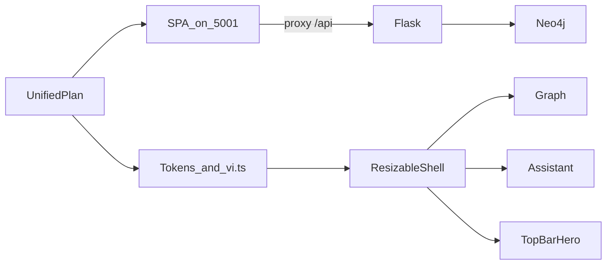

# KG Explorer — Unified Frontend & Product Plan

**Status:** canonical — **only** planning document for frontend redesign and rollout (2026).  
**Location:** `docs/unified-frontend-redesign-plan.md`

---

## Summary

Migration-first rebuild of KG Explorer: **Vite + React + TypeScript** SPA on public port **5001** (Nginx `kg-ui`), **Flask API-first** behind `/api/*`, **Neo4j** unchanged. Vietnamese-first copy (`frontend/src/content/copy/vi.ts`), graph-centered workspace with **resizable side panels**, **topbar hero** (expand/collapse), and a **neumorphic / soft-UI** direction aligned with **`.agents/skills/design-system/SKILL.md`** (TypeUI) and tokens in **`frontend/src/styles/tokens.css`**.

---

## Problem frame

The product grew from a single Flask template (`kg_from_scratch/templates/index.html`) with mixed copy and coupled layout. Earlier planning was split across multiple docs with conflicting stack and ordering choices. This file replaces all of that with **one** execution path: migrate the UI early to a dedicated frontend without blocking backend pipelines beyond the API boundary.

---

## Requirements

| ID | Requirement |
|----|-------------|
| R1 | **Single plan doc:** This file is the only normative plan; implementation details live in code and `vi.ts`. |
| R2 | **Migration-first:** Public UI is the SPA; Flask serves JSON/API for production traffic behind Nginx. |
| R3 | **Stable entrypoint:** Host **5001** remains the public URL (e.g. Cloudflare → tunnel → `localhost:5001`). |
| R4 | **Vietnamese UI:** User-facing strings in Vietnamese except glossary terms (Neo4j, Cypher, model IDs, tickers where useful). |
| R5 | **Professional UI:** Avoid generic “AI dashboard” clichés; follow agreed design skill + tokens. |
| R6 | **Resizable panels:** Left/right widths draggable; persist `kg_panel_left_w`, `kg_panel_right_w`. |
| R7 | **Topbar hero:** Orientation copy in the top bar with expand/collapse; no duplicate hero over the graph. |
| R8 | **Parity:** Graph modes (companies / leadership), neighbors, node detail, RAG chat, Cypher/steps overlay, crawl, stats, rules, top entities, search. |

---

## Scope boundaries

**In scope:** Shell, SPA architecture, copy, deployment path, Docker/Nginx, API consumption.

**Out of scope:** Neo4j schema redesign, replacing crawl/inference pipelines before the UI migration is stable.

**Deferred:** Optional graph engine swap beyond vis-network parity; backend modularization beyond what the SPA needs.

---

## Architecture

```
Browser :5001 → Nginx (kg-ui) → static SPA
              → proxy /api/* → Flask (kg-app) internal :5001 (host debug often :5002)
              → Neo4j (internal)
```

- **Development:** `cd frontend && npm run dev` — Vite proxies `/api` → Flask (e.g. `http://127.0.0.1:5001`).
- **Production:** Nginx serves `dist/`; `/api/` → `http://kg-app:5001`.

---

## Key technical decisions

| Topic | Decision |
|-------|----------|
| Frontend | Vite, React 18, TypeScript |
| Graph | `vis-network` + `vis-data` (parity with legacy template) |
| API | Same-origin `/api/*` behind Nginx |
| Copy | `frontend/src/content/copy/vi.ts` + glossary |
| Theme | `data-theme` on `document.documentElement`; CSS variables in `tokens.css` |
| Design skill | Neumorphism / soft UI: `.agents/skills/design-system/SKILL.md` |

---

## Design system (normative)

- **Tone:** Serious investigation console for Vietnamese listed companies.
- **Typography & color:** Follow locked tokens in `frontend/src/styles/tokens.css` (mono-forward stack per skill; semantic palette primary `#006666`, surface `#E7E5E4`, etc., with dark-theme analogs).
- **Motion:** Subtle; respect `prefers-reduced-motion`.
- **Accessibility:** Visible `:focus-visible`, semantic HTML, keyboard-first controls.

---

## Phased delivery

1. Docs + scaffold + Docker wiring for SPA + API.
2. Shell + copy + topbar hero + resizable rails.
3. Graph + node detail + overlays.
4. Assistant + crawl + stats/rules/top lists.
5. Hardening: responsive QA, checklist below.

---

## Implementation units (reference)

**U1 — Documentation:** This single canonical doc; no parallel plan files.

**U2 — Frontend architecture:** `frontend/`, `Dockerfile.frontend`, `docker-compose.yml` (`kg-ui` on 5001, `kg-app` exposed as needed), `docker/nginx.conf`, `kg_from_scratch/script.py` (`GET /` JSON for API-first).

**U3 — Design system & copy:** `vi.ts`, `tokens.css`, optional skill alignment.

**U4 — Workspace shell:** TopBar, panels, resize handles, responsive behavior.

**U5 — Features:** Graph, assistant, node detail; preserve workflows.

**U6 — Rollout:** Docker cutover, manual QA (checklist).

---

## API surface (reference)

`/api/graph`, `/api/node/:id`, `/api/node/:id/neighbors`, `/api/stats`, `/api/stats/exchange`, `/api/stats/top`, `/api/rules`, `/api/search`, `/api/query`, `/api/crawl/start`, `/api/crawl/progress`, `/api/vllm/models`, optional `/api/inference`.

---

## Risks & mitigations

| Risk | Mitigation |
|------|------------|
| Large surface area | Ship incrementally; keep `vi.ts` as single copy source |
| Mixed HTML/API routes | Keep JSON routes stable; drop HTML shell only after SPA parity |
| Docker drift | Test `docker compose up --build` locally before tunnel QA |

---

## Rollout QA checklist

Use before/after Docker cutover and Cloudflare tunnel QA.

### Local development (no Docker)

- Run Flask on **5001** (`python script.py` under `kg_from_scratch` as you already do).
- Run **`cd frontend && npm run dev`**; Vite proxies `/api` to `http://127.0.0.1:5001`.
- Open the UI at the **Vite** URL (e.g. **5173**). Direct `http://localhost:5001/` may return JSON only when API is API-first without Nginx.

### Compose / networking

- `docker compose up --build` completes; **kg-ui** maps host **5001** → Nginx **80**; **kg-app** API often on **5002** for optional host debugging.
- `curl -sSf http://localhost:5001/` returns SPA HTML (from Nginx).
- `curl -sSf http://localhost:5001/api/stats` returns JSON (proxied).
- Optional: `curl -sSf http://localhost:5002/` returns JSON `service: kg-api`.

### Shell UX

- Left/right drag resize; reload persists panel widths.
- Collapse toggles; graph remains usable.
- Topbar hero expand/collapse; theme persists.

### Graph & investigation

- Companies / leadership modes; neighbor expand/collapse.
- Node detail on click; close clears selection.
- Query overlay shows Cypher/steps when assistant returns them.

### Assistant & crawl

- Chat with updated history; long `/api/query` completes (Nginx timeouts, e.g. 600s).
- Crawl progress + stats refresh.

### Responsive

- Desktop: graph centered; panels usable.
- Narrow viewport: no unusable clipping or focus traps (spot-check).

---

## References

- `.agents/skills/design-system/SKILL.md` (Neumorphism / TypeUI)
- [TypeUI Design Skills](https://www.typeui.sh/design-skills)
- [Anthropic frontend-design skill](https://github.com/anthropics/skills/blob/main/skills/frontend-design/SKILL.md)
- Code: `frontend/`, `Dockerfile.frontend`, `docker-compose.yml`, `docker/nginx.conf`, `kg_from_scratch/script.py`
- Legacy template (migration reference only): `kg_from_scratch/templates/index.html`

---

## Technical diagram


